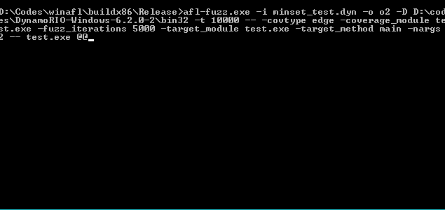
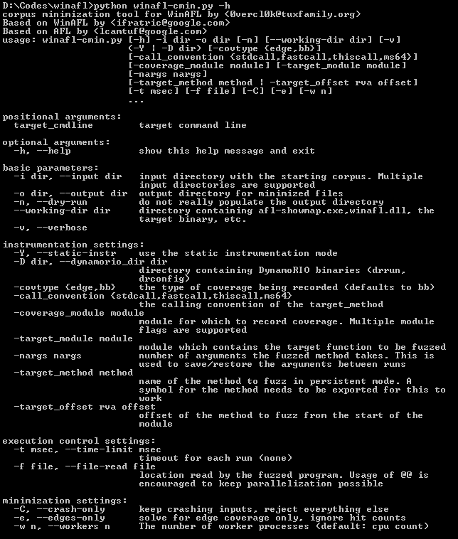

# WinAFL

```
   Original AFL code written by Michal Zalewski <lcamtuf@google.com>

   Windows fork written and maintained by Ivan Fratric <ifratric@google.com>

   Copyright 2016 Google Inc. All Rights Reserved.

   Licensed under the Apache License, Version 2.0 (the "License");
   you may not use this file except in compliance with the License.
   You may obtain a copy of the License at

       http://www.apache.org/licenses/LICENSE-2.0

   Unless required by applicable law or agreed to in writing, software
   distributed under the License is distributed on an "AS IS" BASIS,
   WITHOUT WARRANTIES OR CONDITIONS OF ANY KIND, either express or implied.
   See the License for the specific language governing permissions and
   limitations under the License.
```

## Background

AFL is a popular fuzzing tool for coverage-guided fuzzing. The tool combines
fast target execution with clever heuristics to find new execution paths in
the target binary. It has been successfully used to find a large number of
vulnerabilities in real products. For more info about the original project,
please refer to the original documentation at:

http://lcamtuf.coredump.cx/afl/

Unfortunately, the original AFL does not work on Windows due to very
*nix-specific design (e.g. instrumentation, forkserver etc). This project is
a fork of AFL that uses different instrumentation approach which works on
Windows even for black box binary fuzzing.

## The WinAFL approach

Instead of instrumenting the code at compilation time, WinAFL supports the
following instrumentation modes:
 - Dynamic instrumentation using DynamoRIO (http://dynamorio.org/)
 - Hardware tracing using Intel PT
 - Static instrumentation via Syzygy

These instrumentation modes are described in more detail in the separate
documents.

<p align="center">

</p>

To improve the process startup time, WinAFL relies heavily on persistent
fuzzing mode, that is, executing multiple input samples without restarting the
target process. This is accomplished by selecting a target function (that the
user wants to fuzz) and instrumenting it so that it runs in a loop.

#### Known CVEs

WinAFL has been successfully used to identify bugs in Windows software, such as

 * [Adobe] CVE-2018-4985, CVE-2018-5063, CVE-2018-5064, CVE-2018-5065, CVE-2018-5068, CVE-2018-5069, CVE-2018-5070, CVE-2018-12754, CVE-2018-12755, CVE-2018-12764, CVE-2018-12765, CVE-2018-12766, CVE-2018-12767, CVE-2018-12768, CVE-2018-12848, CVE-2018-12849, CVE-2018-12850, CVE-2018-12840, CVE-2018-15956, CVE-2018-15955, CVE-2018-15954,CVE-2018-15953, CVE-2018-15952, CVE-2018-15938, CVE-2018-15937, CVE-2018-15936, CVE-2018-15935, CVE-2018-15934, CVE-2018-15933, CVE-2018-15932 , CVE-2018-15931, CVE-2018-15930 , CVE-2018-15929, CVE-2018-15928, CVE-2018-15927, CVE-2018-12875, CVE-2018-12874 , CVE-2018-12873, CVE-2018-12872,CVE-2018-12871, CVE-2018-12870, CVE-2018-12869, CVE-2018-12867 , CVE-2018-12866, CVE-2018-12865 , CVE-2018-12864 , CVE-2018-12863, CVE-2018-12862, CVE-2018-12861, CVE-2018-12860, CVE-2018-12859, CVE-2018-12857, CVE-2018-12839 - found by Yoav Alon and Netanel Ben-Simon from Check Point Software Technologies
 * [Adobe] CVE-2018-12853, CVE-2018-16024, CVE-2018-16023, CVE-2018-15995 - found by Guy Inbar (guyio)
 * [Adobe] CVE-2018-16004, CVE-2018-16005, CVE-2018-16007, CVE-2018-16009, CVE-2018-16010, CVE-2018-16043, CVE-2018-16045, CVE-2018-16046, CVE-2018-19719, CVE-2018-19720, CVE-2019-7045 - found by Sebastian Apelt ([@bitshifter123](https://twitter.com/bitshifter123))
 * [Microsoft] CVE-2016-7212 - found by Aral Yaman of Noser Engineering AG
 * [Microsoft] CVE-2017-0073, CVE-2017-0190, CVE-2017-11816, CVE-2018-8472, CVE-2019-1311 - found by [Symeon Paraschoudis](https://twitter.com/symeonp)
 * [Microsoft] CVE-2018-8494 - found by Guy Inbar (guyio)
 * [Microsoft] CVE-2018-8464 - found by Omri Herscovici of Check Point
 * [Microsoft] CVE-2019-0576, CVE-2019-0577, CVE-2019-0579, CVE-2019-0538, CVE-2019-0580, CVE-2019-0879, CVE-2019-0889, CVE-2019-0891, CVE-2019-0899, CVE-2019-0902, CVE-2019-1243, CVE-2019-1250 - found by Hardik Shah of McAfee 
 * [Kollective Kontiki 10.0.1] CVE-2018-11672 - found by Maksim Shudrak from Salesforce
 * [Mozilla] CVE-2018-5177 - found by Guy Inbar (guyio)
 * [libxml2] CVE-2018-14404 - found by Guy Inbar (guyio)
 * [WinRAR] CVE-2018-20250, CVE-2018-20251, CVE-2018-20252, CVE-2018-20253 - found by Nadav Grossman of Check Point Software Technologies
 * [Various image viewers] CVE-2019-13083, CVE-2019-13084, CVE-2019-13085, CVE-2019-13242, CVE-2019-13243, CVE-2019-13244, CVE-2019-13245, CVE-2019-13246, CVE-2019-13247, CVE-2019-13248, CVE-2019-13249, CVE-2019-13250, CVE-2019-13251, CVE-2019-13252, CVE-2019-13253, CVE-2019-13254, CVE-2019-13255, CVE-2019-13256, CVE-2019-13257, CVE-2019-13258, CVE-2019-13259, CVE-2019-13260, CVE-2019-13261, CVE-2019-13262 - found by found by [@expend20](https://twitter.com/expend20) and Anton Kukoba of Apriorit
 * [Foxit] CVE-2019-13330, CVE-2019-13331 - found by Natnael Samson ([@NattiSamson](https://twitter.com/NattiSamson))
 
(Let me know if you know of any others and I'll include them in the list)

## Building WinAFL

1. If you are building with DynamoRIO support, download and build
DynamoRIO sources or download DynamoRIO Windows binary package from
https://github.com/DynamoRIO/dynamorio/wiki/Downloads

2. If you are building with Intel PT support, pull third party dependencies by running `git submodule update --init --recursive` from the WinAFL source directory

3. Open Visual Studio Command Prompt (or Visual Studio x64 Win64 Command Prompt
if you want a 64-bit build). Note that you need a 64-bit winafl.dll build if
you are fuzzing 64-bit targets and vice versa.

4. Go to the directory containing the source

5. Type the following commands. Modify the -DDynamoRIO_DIR flag to point to the
location of your DynamoRIO cmake files (either full path or relative to the
source directory).

### For a 32-bit build:

```
mkdir build32
cd build32
cmake -G"Visual Studio 15 2017" .. -DDynamoRIO_DIR=..\path\to\DynamoRIO\cmake -DINTELPT=1
cmake --build . --config Release
```

### For a 64-bit build:

```
mkdir build64
cd build64
cmake -G"Visual Studio 15 2017 Win64" .. -DDynamoRIO_DIR=..\path\to\DynamoRIO\cmake -DINTELPT=1
cmake --build . --config Release
```

### Build configuration options

The following cmake configuration options are supported:

 - `-DDynamoRIO_DIR=..\path\to\DynamoRIO\cmake` - Needed to build the
   winafl.dll DynamoRIO client

 - `-DINTELPT=1` - Enable Intel PT mode. For more information see
   https://github.com/googleprojectzero/winafl/blob/master/readme_pt.md

 - `-DUSE_COLOR=1` - color support (Windows 10 Anniversary edition or higher)

 - `-DUSE_DRSYMS=1` - Drsyms support (use symbols when available to obtain
   -target_offset from -target_method). Enabling this has been known to cause
   issues on Windows 10 v1809, though there are workarounds,
   see https://github.com/googleprojectzero/winafl/issues/145

## Using WinAFL

The command line for afl-fuzz on Windows is different than on Linux. Instead of:

```
%s [ afl options ] -- target_cmd_line
```

it now looks like this:

```
afl-fuzz [afl options] -- [instrumentation options] -- target_cmd_line
```

The following afl-fuzz options are supported:

```
  -i dir        - input directory with test cases
  -o dir        - output directory for fuzzer findings
  -D dir        - directory containing DynamoRIO binaries (drrun, drconfig)
  -p            - persist DynamoRIO cache across target process restarts
  -t msec       - timeout for each run
  -I msec       - timeout for process initialization and first run
  -f file       - location read by the fuzzed program
  -M \\ -S id   - distributed mode
  -x dir        - optional fuzzer dictionary
  -m limit      - memory limit for the target process
```

Please refer to the original AFL documentation for more info on these flags.

To see the supported instrumentation flags, please refer to the documentation
on the specific instrumentation mode you are interested in.

## How does my target run under WinAFL

When you select a target function and fuzz an application the following happens:

1. Your target runs normally until your target function is reached.
2. WinAFL starts recording coverage
3. Your target function runs until return
4. WinAFL reports coverage, rewrites the input file and patches EIP
   so that the execution jumps back to step 2
5. After your target function runs for the specified number of iterations,
   the target process is killed and restarted. Note that anything that runs
   after the target function returns is never reached.

## How to select a target function

The target function should do these things during its lifetime:

1. Open the input file. This needs to happen withing the target function so
   that you can read a new input file for each iteration as the input file is
   rewritten between target function runs).
2. Parse it (so that you can measure coverage of file parsing)
3. Close the input file. This is important because if the input file is
   not closed WinAFL won't be able to rewrite it.
4. Return normally (So that WinAFL can "catch" this return and redirect
   execution. "returning" via ExitProcess() and such won't work)

## Instrumentation modes

The following documents provide information on using different insrumentation
modes with WinAFL:

 - [Dynamic instrumentation using DynamoRIO](https://github.com/googleprojectzero/winafl/blob/master/readme_dr.md)
 - [Hardware tracing using Intel PT](https://github.com/googleprojectzero/winafl/blob/master/readme_pt.md)
 - [Static instrumentation via Syzygy](https://github.com/googleprojectzero/winafl/blob/master/readme_syzygy.md)

Before using WinAFL for the first time, you should read the documentation for
the specific instrumentation mode you are interested in. These also contain
usage examples.

## Corpus minimization

WinAFL includes the windows port of afl-cmin in winafl-cmin.py. Please run the
below command to see the options and usage examples:

```
D:\Codes\winafl>python winafl-cmin.py -h
[...]
Examples of use:
 * Typical use
  winafl-cmin.py -D D:\DRIO\bin32 -t 100000 -i in -o minset -covtype edge -coverage_module m.dll -target_module test.exe -target_method fuzz -nargs 2 -- test.exe @@

 * Dry-run, keep crashes only with 4 workers with a working directory:
  winafl-cmin.py -C --dry-run -w 4 --working-dir D:\dir -D D:\DRIO\bin32 -t 10000 -i in -i C:\fuzz\in -o out_mini -covtype edge -coverage_module m.dll -target_module test.exe -target_method fuzz -nargs 2 -- test.exe @@

 * Read from specific file
  winafl-cmin.py -D D:\DRIO\bin32 -t 100000 -i in -o minset -f foo.ext -covtype edge -coverage_module m.dll -target_module test.exe -target_method fuzz -nargs 2 -- test.exe @@

 * Read from specific file with pattern
  winafl-cmin.py -D D:\DRIO\bin32 -t 100000 -i in -o minset -f prefix-@@-foo.ext -covtype edge -coverage_module m.dll -target_module test.exe -target_method fuzz -nargs 2 -- test.exe @@

 * Typical use with static instrumentation
   winafl-cmin.py -Y -t 100000 -i in -o minset -- test.exe @@
```

<p align="center">

</p>

## Custom test cases processing

WinAFL supports third party DLLs that can be used to define custom test-cases processing (e.g. to send test cases over network). To enable this option, you need to specify ```-l <path>``` argument.
The DLL should export the following two functions:
```
dll_init()
dll_run(char *data, long size, int fuzz_iterations)
data - content of test case
size - size of test case
fuzz_iterations - defines a current fuzzing iteration number
```

We have implemented two sample DLLs for network-based applications fuzzing that you can customize for your own purposes.

### Network fuzzing

WinAFL's ```custom_net_fuzzer.dll``` allows winAFL to perform network-based applications fuzzing that receive and parse network data. There are several options supported by this DLL that should be provided via the environment variable ```AFL_CUSTOM_DLL_ARGS```:

```
  -a IP address - IP address to send data in
  -U            - use UDP protocol instead of TCP to send data (default TCP)
  -p port       - port to send data in
  -w msec       - delay in milliseconds before actually start fuzzing
```
For example, if your application receives network packets via UDP protocol at port 7714 you should setup environment variable in the following way: ```set AFL_CUSTOM_DLL_ARGS=-U -p 7714 -a 127.0.0.1 -w 1000 ```

You still need to find target function and make sure that this function receives data from the network, parses it, and returns normally. Also, you can use In App Persistence mode described above if your application runs the target function in a loop by its own.

Additionally, this mode is considered as experimental since we have experienced some problems with stability and performance. However, we found this option very usefull and managed to find several vulnerabilities in network-based applications (e.g. in Kollective Kontiki listed above).

There is a second DLL ```custom_winafl_server.dll``` that allows winAFL to act as a server and perform fuzzing of client-based applications. All you need is to setup port to listen on for incoming connections from your target application. The environment variable ```AFL_CUSTOM_DLL_ARGS=<port_id>``` should be used for this purpose.

#### Note

In case of server fuzzing, if the server socket has the `SO_REUSEADDR` option set like the following code, then this may case `10055` error after some time fuzzing due to the accumulation of `TIME_WAIT` sockets when WinAFL restart the fuzzing process. 
```
setsockopt(s, SOL_SOCKET, SO_REUSEADDR, (char*)&opt, sizeof(int));
```

To avoid this replace the `SO_REUSEADDR` option by `SO_LINGER` option in the server source code if availabe.
```
setsockopt(s, SOL_SOCKET, SO_LINGER, (char*)&opt, sizeof(int));
```

## FAQ

```
Q: WinAFL reports timeouts while processing initial testcases.
A: You should run your target in debug mode first (-debug flag) and only
   run WinAFL once you get a message in the debug log that everything
   appears to be running normally.

Q: WinAFL runs slower than expected
A: This can commonly happen for several reasons
 - Your target function loads a dll for every iteration. This causes
   DynamoRIO to translate the same code for every iteration which causes
   slowdowns. You will be able to see this in the debug log. To
   resolve, select (or write) your target function differently.
 - Your target function does not close the input file properly, which
   causes WinAFL to kill the process in order to rewrite it. Please refer
   to 6) for what a target function should look like.

Q: Can I fuzz DLLs with WinAFL
A: Yes, if you can write a harness that loads a library and runs some
   function within. Write your target function according to "How to select
   a target function" and for best performance, load the dll outside of
   your target function (see the previous question).

Q: Can I fuzz GUI apps with WinAFL
A: Yes, provided that
 - There is a target function that behaves as explained in "How to select
   a target function"
 - The target function is reachable without user interaction
 - The target function runs and returns without user interaction
 If these conditions are not satisfied, you might need to make custom changes
 to WinAFL and/or your target.
```

## Special Thanks

Special thanks to Axel "[0vercl0k](https://twitter.com/0vercl0k)" Souchet of MSRC Vulnerabilities and
Mitigations Team for his contributions!
