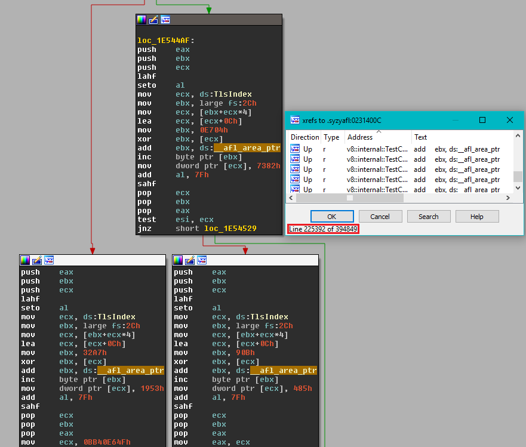

# WinAFL

```
   Original AFL code written by Michal Zalewski <lcamtuf@google.com>

   Windows fork written and maintained by Ivan Fratric <ifratric@google.com>

   Copyright 2016 Google Inc. All Rights Reserved.

   Licensed under the Apache License, Version 2.0 (the "License");
   you may not use this file except in compliance with the License.
   You may obtain a copy of the License at

       http://www.apache.org/licenses/LICENSE-2.0

   Unless required by applicable law or agreed to in writing, software
   distributed under the License is distributed on an "AS IS" BASIS,
   WITHOUT WARRANTIES OR CONDITIONS OF ANY KIND, either express or implied.
   See the License for the specific language governing permissions and
   limitations under the License.
```

## Background

AFL is a popular fuzzing tool for coverage-guided fuzzing. The tool combines
fast target execution with clever heuristics to find new execution paths in
the target binary. It has been successfully used to find a large number of
vulnerabilities in real products. For more info about the original project,
please refer to the original documentation at:

http://lcamtuf.coredump.cx/afl/

Unfortunately, the original AFL does not work on Windows due to very
*nix-specific design (e.g. instrumentation, forkserver etc). This project is
a fork of AFL that uses different instrumentation approach which works on
Windows even for black box binary fuzzing.

## The WinAFL approach

Instead of instrumenting the code at compilation time, WinAFL relies on dynamic
instrumentation using DynamoRIO (http://dynamorio.org/) to measure and extract
target coverage. This approach has been found to introduce an overhead about 2x
compared to the native execution speed, which is comparable to the original AFL
in binary instrumentation mode.

<p align="center">

</p>

To improve the process startup time, WinAFL relies heavily on persistent
fuzzing mode, that is, executing multiple input samples without restarting the
target process. This is accomplished by selecting a target function (that the
user wants to fuzz) and instrumenting it so that it runs in a loop.

WinAFL has been successfully used to identify bugs in Windows software, such as

 * [Microsoft] CVE-2016-7212 - found by Aral Yaman of Noser Engineering AG
 * [Microsoft] CVE-2017-0073, CVE-2017-0190, CVE-2017-11816, CVE-2018-8472 - found by [Symeon Paraschoudis](https://twitter.com/symeonp)
 * [Microsoft] CVE-2018-8494 - found by Guy Inbar (guyio)
 * [Microsoft] CVE-2018-8464 - found by Omri Herscovici of Check Point
 * [Adobe] CVE-2018-4985, CVE-2018-5063, CVE-2018-5064, CVE-2018-5065, CVE-2018-5068, CVE-2018-5069, CVE-2018-5070, CVE-2018-12754, CVE-2018-12755, CVE-2018-12764, CVE-2018-12765, CVE-2018-12766, CVE-2018-12767, CVE-2018-12768, CVE-2018-12848, CVE-2018-12849, CVE-2018-12850, CVE-2018-12840, CVE-2018-15956, CVE-2018-15955, CVE-2018-15954,CVE-2018-15953, CVE-2018-15952, CVE-2018-15938, CVE-2018-15937, CVE-2018-15936, CVE-2018-15935, CVE-2018-15934, CVE-2018-15933, CVE-2018-15932 , CVE-2018-15931, CVE-2018-15930 , CVE-2018-15929, CVE-2018-15928, CVE-2018-15927, CVE-2018-12875, CVE-2018-12874 , CVE-2018-12873, CVE-2018-12872,CVE-2018-12871, CVE-2018-12870, CVE-2018-12869, CVE-2018-12867 , CVE-2018-12866, CVE-2018-12865 , CVE-2018-12864 , CVE-2018-12863, CVE-2018-12862, CVE-2018-12861, CVE-2018-12860, CVE-2018-12859, CVE-2018-12857, CVE-2018-12839 - found by Yoav Alon and Netanel Ben-Simon from Check Point Software Technologies
 * [Adobe] CVE-2018-12853, CVE-2018-16024, CVE-2018-16023, CVE-2018-15995 - found by Guy Inbar (guyio)
 * [Kollective Kontiki 10.0.1] CVE-2018-11672 - found by Maksim Shudrak from Salesforce
 * [Mozilla] CVE-2018-5177 - found by Guy Inbar (guyio)
 * [libxml2] CVE-2018-14404 - found by Guy Inbar (guyio)
 
(Let me know if you know of any others and I'll include them in the list)

## Building WinAFL

1. Download and build DynamoRIO sources or download DynamoRIO Windows binary
package from https://github.com/DynamoRIO/dynamorio/wiki/Downloads

2. Open Visual Studio Command Prompt (or Visual Studio x64 Win64 Command Prompt
if you want a 64-bit build). Note that you need a 64-bit winafl.dll build if
you are fuzzing 64-bit targets and vice versa.

3. Go to the directory containing the source

4. Type the following commands. Modify the -DDynamoRIO_DIR flag to point to the
location of your DynamoRIO cmake files (either full path or relative to the
source directory).

### For a 32-bit build:

```
mkdir build32
cd build32
cmake -G"Visual Studio 15 2017" .. -DDynamoRIO_DIR=..\path\to\DynamoRIO\cmake
cmake --build . --config Release
```

### For a 64-bit build:

```
mkdir build64
cd build64
cmake -G"Visual Studio 15 2017 Win64" .. -DDynamoRIO_DIR=..\path\to\DynamoRIO\cmake
cmake --build . --config Release
```

For color support (Windows 10 Anniversary edition or higher), add
`-DUSE_COLOR=1` to the cmake configuration line.

## Using WinAFL

Note: If you are using pre-built binaries you'll need to download DynamoRIO
release 6.2.0-2 from https://github.com/DynamoRIO/dynamorio/wiki/Downloads.
If you built WinAFL from source, you can use whatever version of DynamoRIO
you used to build WinAFL.

The command line for afl-fuzz on Windows is different than on Linux. Instead of:

```
%s [ afl options ] -- target_cmd_line
```

it now looks like this:

```
afl-fuzz [afl options] -- [instrumentation options] -- target_cmd_line
```

The following afl-fuzz options are supported:

```
  -i dir        - input directory with test cases
  -o dir        - output directory for fuzzer findings
  -D dir        - directory containing DynamoRIO binaries (drrun, drconfig)
  -p            - persist DynamoRIO cache across target process restarts
  -t msec       - timeout for each run
  -I msec       - timeout for process initialization and first run
  -f file       - location read by the fuzzed program
  -M \\ -S id   - distributed mode
  -x dir        - optional fuzzer dictionary
  -m limit      - memory limit for the target process
```

Please refer to the original AFL documentation for more info on these flags.

The following instrumentation options are used:

```
  -covtype         - the type of coverage being recorded. Supported options are
                     bb (basic block, default) or edge.

  -coverage_module - module for which to record coverage. Multiple module flags
                     are supported.

  -target_module   - module which contains the target function to be fuzzed.
                     Either -target_method or -target_offset need to be
                     specified together with this option.

  -target_method   - name of the method to fuzz in persistent mode. For this to
                     work either the method needs to be exported or the symbols
                     for target_module need to be available. Otherwise use
                     -target_offset instead.

  -target_offset   - offset of the method to fuzz from the start of the module.

  -fuzz_iterations - Maximum number of iterations for the target function to run
                     before restarting the target process.

  -nargs           - Number of arguments the fuzzed method takes. This is used
                     to save/restore the arguments between runs.

  -debug           - Debug mode. Does not try to connect to the server. Outputs
                     a log file containing loaded modules, opened files and
                     coverage information.

  -logdir          - specifies in which directory the log file will be written
                     (only to be used with -debug).

  -call_convention - The default calling convention is cdecl on 32-bit x86
                     platforms and Microsoft x64 for Visual Studio 64-bit
                     applications. Possible values:
                         * fastcall: fastcall
                         * ms64: Microsoft x64 (Visual Studio)
                         * stdcall: cdecl or stdcall
                         * thiscall: thiscall

  -thread_coverage - If set, WinAFL will only collect coverage from a thread
                     that executed the target function
```

In general, you should perform the following steps when fuzzing a new target:

1. Make sure your target is running correctly without instrumentations.

2. Open the target binary in WinDbg and locate the function you want to fuzz.
Note the offset of the function from the start of the module. For example, if
you want to fuzz the main function and happen to have symbols around, you can
use the following windbg command:

```
x test!main
```

3. Make sure that the target is running correctly under DynamoRIO. For this
purpose you can use the standalone debug mode of WinAFL client which does not
require connecting to afl-fuzz. Make sure you use the drrun.exe and winafl.dll
version which corresponds to your target (32 vs. 64 bit).

Example command line:

```
path\to\DynamoRIO\bin64\drrun.exe -c winafl.dll -debug
-target_module test_gdiplus.exe -target_offset 0x16e0 -fuzz_iterations 10
-nargs 2 -- test_gdiplus.exe input.bmp
```

You should see the output corresponding to your target function being run 10
times after which the target executable will exit. A .log file should be
created in the current directory. The log file contains useful information
such as the files and modules loaded by the target as well as the dump of AFL
coverage map. In the log you should see pre_fuzz_handler and post_fuzz_handler
being run exactly 10 times as well as your input file being open in each
iteration. Note the list of loaded modules for setting the -coverage_module
flag. Note that you must use the same values for module names as seen in the
log file (not case sensitive).

4. Now you should be ready to fuzz the target. First, make sure that both
afl-fuzz.exe and winafl.dll are in the current directory. As stated earlier,
the command line for afl-fuzz on Windows is:

```
afl-fuzz [afl options] -- [instrumentation options] -- target_cmd_line
```

Please refer above for the list of supported AFL and instrumentation options.

In AFL options, you must specify the DynamoRIO binaries directory via the new
-D option. You need to match the DynamoRIO and winafl.dll build (32 vs. 64 bit)
to the target binary. -t (timeout) option is mandatory for WinAFL as execution
time can vary significantly under instrumentation so it's not a good idea to
rely on the auto-determined values.

You can use the same WinAFL options as in step 2 but remember to exclude the
-debug flag and you'll probably want to increase the iteration count.

As in afl-fuzz on Linux you can replace the input file parameter of the target
binary with @@.

An example command line would look like:

```
afl-fuzz.exe -i in -o out -D C:\work\winafl\DynamoRIO\bin64 -t 20000 --
-coverage_module gdiplus.dll -coverage_module WindowsCodecs.dll
-fuzz_iterations 5000 -target_module test_gdiplus.exe -target_offset 0x16e0
-nargs 2 -- test_gdiplus.exe @@
```

Alternately, if symbols for test_gdiplus.exe are available, you can use
-target_method instead of -target_offset like so:

```
afl-fuzz.exe -i in -o out -D C:\work\winafl\DynamoRIO\bin64 -t 20000 --
-coverage_module gdiplus.dll -coverage_module WindowsCodecs.dll
-fuzz_iterations 5000 -target_module test_gdiplus.exe -target_method main
-nargs 2 -- test_gdiplus.exe @@
```

That's it. Happy fuzzing!

## How does my target run under WinAFL

When you select a target function and fuzz an application the following happens:

1. Your target runs normally until your target function is reached.
2. WinAFL starts recording coverage
3. Your target function runs until return
4. WinAFL reports coverage, rewrites the input file and patches EIP
   so that the execution jumps back to step 2
5. After your target function runs for the specified number of iterations,
   the target process is killed and restarted. Note that anything that runs
   after the target function returns is never reached.

## How to select a target function

The target function should do these things during its lifetime:

1. Open the input file. This needs to happen withing the target function so
   that you can read a new input file for each iteration as the input file is
   rewritten between target function runs).
2. Parse it (so that you can measure coverage of file parsing)
3. Close the input file. This is important because if the input file is
   not closed WinAFL won't be able to rewrite it.
4. Return normally (So that WinAFL can "catch" this return and redirect
   execution. "returning" via ExitProcess() and such won't work)

## In App Persistence mode

This feature is a tweak for the traditional "target function" approach and aims
to loosen the requirements of the target function to do both reading
an input file and processing the input file.

In some applications it's quite challenging to find a target function
that with a simple execution redirection won't break global states and will do
both reading and processing of inputs.

This mode assumes that the target application will actually loop
the target function by itself, and will handle properly its global state
For example a udp server handling packets or a js interpreter running inside
a while loop.

This mode works as following:
1. Your target runs until hitting the target function.
2. The afl server starts instrumenting the target.
3. Your target runs until hitting the target function again.
4. The afl server stops instrumenting current cycle and starts a new one.

usage: add the following option to the winafl arguments:
-persistence_mode in_app

example usage on the supplied test.exe:
afl-fuzz.exe -i in -o out -D <dynamorio bin path> -t 100+ -- -coverage_module test.exe -fuzz_iterations 5000 -target_module test.exe -target_offset 0x1000 -nargs 2 -persistence_mode in_app -- test.exe @@ loop


## Corpus minimization

WinAFL includes the windows port of afl-cmin in winafl-cmin.py. Please run the
below command to see the options and usage examples:

```
D:\Codes\winafl>python winafl-cmin.py -h
[...]
Examples of use:
 * Typical use
  winafl-cmin.py -D D:\DRIO\bin32 -t 100000 -i in -o minset -covtype edge -coverage_module m.dll -target_module test.exe -target_method fuzz -nargs 2 -- test.exe @@

 * Dry-run, keep crashes only with 4 workers with a working directory:
  winafl-cmin.py -C --dry-run -w 4 --working-dir D:\dir -D D:\DRIO\bin32 -t 10000 -i in -i C:\fuzz\in -o out_mini -covtype edge -coverage_module m.dll -target_module test.exe -target_method fuzz -nargs 2 -- test.exe @@

 * Read from specific file
  winafl-cmin.py -D D:\DRIO\bin32 -t 100000 -i in -o minset -f foo.ext -covtype edge -coverage_module m.dll -target_module test.exe -target_method fuzz -nargs 2 -- test.exe @@

 * Read from specific file with pattern
  winafl-cmin.py -D D:\DRIO\bin32 -t 100000 -i in -o minset -f prefix-@@-foo.ext -covtype edge -coverage_module m.dll -target_module test.exe -target_method fuzz -nargs 2 -- test.exe @@

 * Typical use with static instrumentation
   winafl-cmin.py -Y -t 100000 -i in -o minset -- test.exe @@
```

<p align="center">

</p>

## Custom test cases processing

WinAFL supports third party DLLs that can be used to define custom test-cases processing (e.g. to send test cases over network). To enable this option, you need to specify ```-l <path>``` argument.
The DLL should export the following two functions:
```
dll_init()
dll_run(char *data, long size, int fuzz_iterations)
data - content of test case
size - size of test case
fuzz_iterations - defines a current fuzzing iteration number
```

We have implemented two sample DLLs for network-based applications fuzzing that you can customize for your own purposes.

### Network fuzzing

WinAFL's ```custom_net_fuzzer.dll``` allows winAFL to perform network-based applications fuzzing that receive and parse network data. There are several options supported by this DLL that should be provided via the environment variable ```AFL_CUSTOM_DLL_ARGS```:

```
  -a IP address - IP address to send data in
  -U            - use UDP protocol instead of TCP to send data (default TCP)
  -p port       - port to send data in
  -w msec       - delay in milliseconds before actually start fuzzing
```
For example, if your application receives network packets via UDP protocol at port 7714 you should setup environment variable in the following way: ```set AFL_CUSTOM_DLL_ARGS=-U -p 7714 -a 127.0.0.1 -w 1000 ```

You still need to find target function and make sure that this function receives data from the network, parses it, and returns normally. Also, you can use In App Persistence mode described above if your application runs the target function in a loop by its own.

Additionally, this mode is considered as experimental since we have experienced some problems with stability and performance. However, we found this option very usefull and managed to find several vulnerabilities in network-based applications (e.g. in Kollective Kontiki listed above).

There is a second DLL ```custom_winafl_server.dll``` that allows winAFL to act as a server and perform fuzzing of client-based applications. All you need is to setup port to listen on for incoming connections from your target application. The environment variable ```AFL_CUSTOM_DLL_ARGS=<port_id>``` should be used for this purpose.

#### Note
In case of server fuzzing, if the server socket has the `SO_REUSEADDR` option set like the following code, then this may case `10055` error after some time fuzzing due to the accumulation of `TIME_WAIT` sockets when WinAFL restart the fuzzing process. 
```
setsockopt(s, SOL_SOCKET, SO_REUSEADDR, (char*)&opt, sizeof(int));
```

To avoid this replace the `SO_REUSEADDR` option by `SO_LINGER` option in the server source code if availabe.
```
setsockopt(s, SOL_SOCKET, SO_LINGER, (char*)&opt, sizeof(int));
```


## Statically instrument a binary via [syzygy](https://github.com/google/syzygy)

### Background

[syzygy](https://github.com/google/syzygy) provides a framework able to _decompose_
PE32 binaries with full PDB. _Decomposing_ a binary is the term used to mean taking
in input a PE32 binary and its PDB, analyze and decompose every functions, every blocks
of code / data in a safe way and present it to transformation "passes".
A transformation pass is a class that transforms the binary in some way; an example is the [syzyasan](https://github.com/google/syzygy/blob/master/syzygy/instrument/transforms/asan_transform.h)
transformation for example. Once the pass has transformed the binary, it passes it back
to the framework which is able to _relink_ an output binary (with the transformations applied
of course).

[AFL instrumentation](https://github.com/google/syzygy/blob/master/syzygy/instrument/transforms/afl_transform.cc) has been added to [syzygy](https://github.com/google/syzygy)'s instrumenter allowing users to instrument PE32
binaries with private symbols statically.

<p align="center">

</p>

### How to write a target function

In order to prepare your target, you need to first include `afl-staticinstr.h` then invoke `__afl_persistent_loop` like in `test_static.cpp`:

```
int fuzz(int argc, char**argv) {
  while(__afl_persistent_loop()) {
    test(argc, argv);
  }
  return 1;
}
```

`__afl_persistent_loop`'s implementation lives inside `afl-staticinstr.c` and basically reproduces what the DynamoRIO plugin is doing in `pre_fuzz_handler` and `post_fuzz_handler`. Every points mentioned in "How to select a target function" applies here too.

You can invoke AFL tools with the flag `-Y` to enable the static instrumentation mode during fuzzing, corpus minimizing or during test-case minimizing:

```
afl-fuzz.exe -Y -i minset -o o1 -t 10000 -- -fuzz_iterations 5000 -- test_static.instr.exe @@
winafl-cmin.py -Y -t 100000 -i in -o minset -- test_static.instr.exe @@
afl-tmin.exe -Y -i ..\testcases\tests\big.txt -o big.min.txt -- test_static.instr.exe @@
```

### Building instrument.exe

For convenience, a version of instrument.exe confirmed to work with WinAFL is included in the bin32 directory. If you want to build it yourself follow the instructions below.

In order to clone [syzygy](https://github.com/google/syzygy/)'s repository you can follow the instructions outlined here: [SyzygyDevelopmentGuide](https://github.com/google/syzygy/wiki/SyzygyDevelopmentGuide). Once you have `depot_tools` and the repository cloned, you can compile instrument.exe like this:

```
C:\syzygy\src>ninja -C out\Release instrument
```

The current recommended revision of the instrumenter is the following: [190dbfe](https://github.com/google/syzygy/commit/190dbfe74c6f5b5913820fa66d9176877924d7c5)(v0.8.32.0).

### Registering msdia140

Make sure to register `msdia140.dll` on your system by executing once the below command:

```
regsvr32 /s msdia140.dll
```

### Instrumenting a target

Your target binary must have been compiled with the [/PROFILE](https://msdn.microsoft.com/en-us/library/ays5x7b0.aspx) linker flag in order to generate a full PDB.

```
C:\>instrument.exe --mode=afl --input-image=test_static.exe --output-image=test_static.instr.exe --force-decompose --multithread --cookie-check-hook
[0718/224840:INFO:application_impl.h(46)] Syzygy Instrumenter Version 0.8.32.0 (0000000).
[0718/224840:INFO:application_impl.h(48)] Copyright (c) Google Inc. All rights reserved.
[0718/224840:INFO:afl_instrumenter.cc(116)] Force decomposition mode enabled.
[0718/224840:INFO:afl_instrumenter.cc(122)] Thread-safe instrumentation mode enabled.
[0718/224840:INFO:afl_instrumenter.cc(128)] Cookie check hook mode enabled.
[...]
[0718/224840:INFO:security_cookie_check_hook_transform.cc(67)] Found a __report_gsfailure implementation, hooking it now.
[0718/224840:INFO:add_implicit_tls_transform.cc(77)] The binary doesn't have any implicit TLS slot defined, injecting one.
[0718/224840:INFO:afl_transform.cc(144)] Placing TLS slot at offset +4.
[0718/224840:INFO:afl_transform.cc(237)] Code Blocks instrumented: 92 (95%)
[...]
[0718/224841:INFO:pe_relinker.cc(240)] PE relinker finished.

C:\>test_static.instr.exe test
Persistent loop implementation by <0vercl0k@tuxfamily.org>
Based on WinAFL by <ifratric@google.com>
[+] Found a statically instrumented module: test_static.instr.exe (multi thread mode).
[-] Not running under afl-fuzz.exe.
[+] Enabling the no fuzzing mode.
Error opening file
```

#### Available options

```
--config=<path>         Specifies a JSON file describing, either
                        a whitelist of functions to instrument or
                        a blacklist of functions to not instrument.
--cookie-check-hook     Hooks __security_cookie_check.
--force-decompose       Forces block decomposition.
--multithread           Uses a thread-safe instrumentation.
```

* config: The JSON file allows you to scope down the instrumentation to a set of function
names. You can either [white list](https://github.com/google/syzygy/blob/master/syzygy/instrument/test_data/afl-good-whitelist.json), or [black list](https://github.com/google/syzygy/blob/master/syzygy/instrument/test_data/afl-good-blacklist.json) functions. It can be very useful to blacklist
functions generating variable behaviors.

* cookie-check-hook: This ensures that the /GS cookie check function generates an exception that
our [VEH](https://msdn.microsoft.com/en-us/library/windows/desktop/ms681420(v=vs.85).aspx) can catch. Failfast exceptions are not catchable by any EH mechanisms in-proc, so we leverage
[syzygy](https://github.com/google/syzygy) to rewrite the cookie check function in order to generate
[an exception we can catch](https://github.com/google/syzygy/blob/master/syzygy/instrument/transforms/security_cookie_check_hook_transform.cc#L81).

* force-decompose: This switch lets you override the decision that [syzygy](https://github.com/google/syzygy/blob/master/syzygy/pe/pe_transform_policy.cc#L175) makes when evaluating
if a function is safe to decompose. If you turn on this flag, your instrumentation coverage will be
higher but you might end-up in an executable that *crashes* in weird ways. Only use if you know what you
are doing.

* multithread: This switch turns on the thread-safe instrumentation. The major difference with the single
thread instrumentation is that `__afl_prev_loc` will be stored in a TLS slot.

### Limitations

With great power comes great responsibility, so here is the list of limitations:

1. Instrumentation is limited to PE 32bits binaries with full PDB symbols (linker flag `/PROFILE`).

2. [syzygy](https://github.com/google/syzygy/) defines [several pre-requirements](https://github.com/google/syzygy/blob/master/syzygy/pe/pe_transform_policy.cc#L175) for being able to decompose safely a block; this might explain why your instrumentation percentage is low.

## FAQ

```
Q: WinAFL reports timeouts while processing initial testcases.
A: You should run your target in debug mode first (-debug flag) and only
   run WinAFL once you get a message in the debug log that everything
   appears to be running normally.

Q: WinAFL runs slower than expected
A: This can commonly happen for several reasons
 - Your target function loads a dll for every iteration. This causes
   DynamoRIO to translate the same code for every iteration which causes
   slowdowns. You will be able to see this in the debug log. To
   resolve, select (or write) your target function differently.
 - Your target function does not close the input file properly, which
   causes WinAFL to kill the process in order to rewrite it. Please refer
   to 6) for what a target function should look like.

Q: Can I fuzz DLLs with WinAFL
A: Yes, if you can write a harness that loads a library and runs some
   function within. Write your target function according to "How to select
   a target function" and for best performance, load the dll outside of
   your target function (see the previous question).

Q: Can I fuzz GUI apps with WinAFL
A: Yes, provided that
 - There is a target function that behaves as explained in "How to select
   a target function"
 - The target function is reachable without user interaction
 - The target function runs and returns without user interaction
 If these conditions are not satisfied, you might need to make custom changes
 to WinAFL and/or your target.
```

## Special Thanks

Special thanks to Axel "[0vercl0k](https://twitter.com/0vercl0k)" Souchet of MSRC Vulnerabilities and
Mitigations Team for his contributions!
