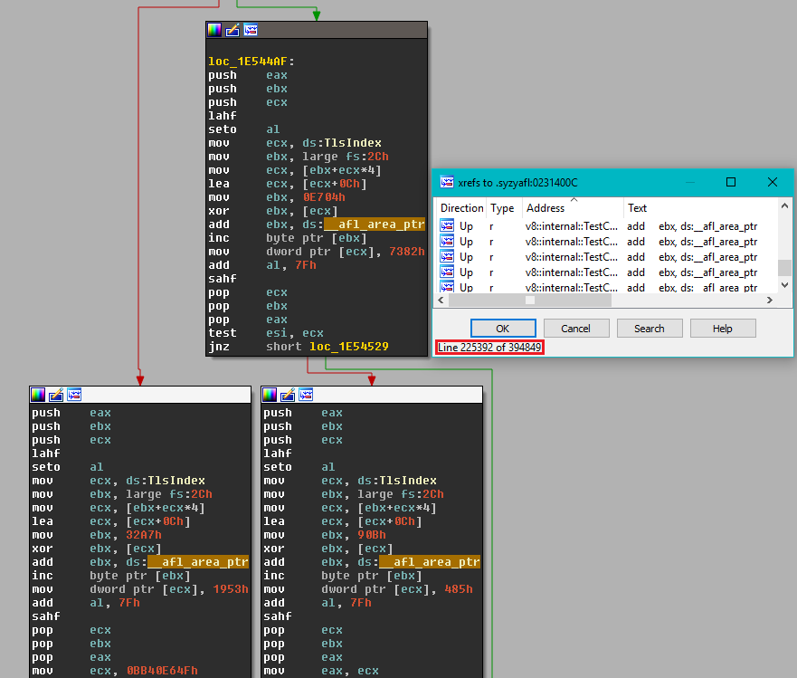

# Statically instrument a binary via [syzygy](https://github.com/google/syzygy)

## Background

[syzygy](https://github.com/google/syzygy) provides a framework able to _decompose_
PE32 binaries with full PDB. _Decomposing_ a binary is the term used to mean taking
in input a PE32 binary and its PDB, analyze and decompose every functions, every blocks
of code / data in a safe way and present it to transformation "passes".
A transformation pass is a class that transforms the binary in some way; an example is the [syzyasan](https://github.com/google/syzygy/blob/master/syzygy/instrument/transforms/asan_transform.h)
transformation for example. Once the pass has transformed the binary, it passes it back
to the framework which is able to _relink_ an output binary (with the transformations applied
of course).

[AFL instrumentation](https://github.com/google/syzygy/blob/master/syzygy/instrument/transforms/afl_transform.cc) has been added to [syzygy](https://github.com/google/syzygy)'s instrumenter allowing users to instrument PE32
binaries with private symbols statically.

<p align="center">

</p>

## How to write a target function

In order to prepare your target, you need to first include `afl-staticinstr.h` then invoke `__afl_persistent_loop` like in `test_static.cpp`:

```
int fuzz(int argc, char**argv) {
  while(__afl_persistent_loop()) {
    test(argc, argv);
  }
  return 1;
}
```

`__afl_persistent_loop`'s implementation lives inside `afl-staticinstr.c` and basically reproduces what the DynamoRIO plugin is doing in `pre_fuzz_handler` and `post_fuzz_handler`. Every points mentioned in "How to select a target function" applies here too.

You can invoke AFL tools with the flag `-Y` to enable the static instrumentation mode during fuzzing, corpus minimizing or during test-case minimizing:

```
afl-fuzz.exe -Y -i minset -o o1 -t 10000 -- -fuzz_iterations 5000 -- test_static.instr.exe @@
winafl-cmin.py -Y -t 100000 -i in -o minset -- test_static.instr.exe @@
afl-tmin.exe -Y -i ..\testcases\tests\big.txt -o big.min.txt -- test_static.instr.exe @@
```

## Building instrument.exe

For convenience, a version of instrument.exe confirmed to work with WinAFL is included in the bin32 directory. If you want to build it yourself follow the instructions below.

In order to clone [syzygy](https://github.com/google/syzygy/)'s repository you can follow the instructions outlined here: [SyzygyDevelopmentGuide](https://github.com/google/syzygy/wiki/SyzygyDevelopmentGuide). Once you have `depot_tools` and the repository cloned, you can compile instrument.exe like this:

```
C:\syzygy\src>ninja -C out\Release instrument
```

The current recommended revision of the instrumenter is the following: [190dbfe](https://github.com/google/syzygy/commit/190dbfe74c6f5b5913820fa66d9176877924d7c5)(v0.8.32.0).

## Registering msdia140

Make sure to register `msdia140.dll` on your system by executing once the below command:

```
regsvr32 /s msdia140.dll
```

## Instrumenting a target

Your target binary must have been compiled with the [/PROFILE](https://msdn.microsoft.com/en-us/library/ays5x7b0.aspx) linker flag in order to generate a full PDB.

```
C:\>instrument.exe --mode=afl --input-image=test_static.exe --output-image=test_static.instr.exe --force-decompose --multithread --cookie-check-hook
[0718/224840:INFO:application_impl.h(46)] Syzygy Instrumenter Version 0.8.32.0 (0000000).
[0718/224840:INFO:application_impl.h(48)] Copyright (c) Google Inc. All rights reserved.
[0718/224840:INFO:afl_instrumenter.cc(116)] Force decomposition mode enabled.
[0718/224840:INFO:afl_instrumenter.cc(122)] Thread-safe instrumentation mode enabled.
[0718/224840:INFO:afl_instrumenter.cc(128)] Cookie check hook mode enabled.
[...]
[0718/224840:INFO:security_cookie_check_hook_transform.cc(67)] Found a __report_gsfailure implementation, hooking it now.
[0718/224840:INFO:add_implicit_tls_transform.cc(77)] The binary doesn't have any implicit TLS slot defined, injecting one.
[0718/224840:INFO:afl_transform.cc(144)] Placing TLS slot at offset +4.
[0718/224840:INFO:afl_transform.cc(237)] Code Blocks instrumented: 92 (95%)
[...]
[0718/224841:INFO:pe_relinker.cc(240)] PE relinker finished.

C:\>test_static.instr.exe test
Persistent loop implementation by <0vercl0k@tuxfamily.org>
Based on WinAFL by <ifratric@google.com>
[+] Found a statically instrumented module: test_static.instr.exe (multi thread mode).
[-] Not running under afl-fuzz.exe.
[+] Enabling the no fuzzing mode.
Error opening file
```

### Available options

```
--config=<path>         Specifies a JSON file describing, either
                        a whitelist of functions to instrument or
                        a blacklist of functions to not instrument.
--cookie-check-hook     Hooks __security_cookie_check.
--force-decompose       Forces block decomposition.
--multithread           Uses a thread-safe instrumentation.
```

* config: The JSON file allows you to scope down the instrumentation to a set of function
names. You can either [white list](https://github.com/google/syzygy/blob/master/syzygy/instrument/test_data/afl-good-whitelist.json), or [black list](https://github.com/google/syzygy/blob/master/syzygy/instrument/test_data/afl-good-blacklist.json) functions. It can be very useful to blacklist
functions generating variable behaviors.

* cookie-check-hook: This ensures that the /GS cookie check function generates an exception that
our [VEH](https://msdn.microsoft.com/en-us/library/windows/desktop/ms681420(v=vs.85).aspx) can catch. Failfast exceptions are not catchable by any EH mechanisms in-proc, so we leverage
[syzygy](https://github.com/google/syzygy) to rewrite the cookie check function in order to generate
[an exception we can catch](https://github.com/google/syzygy/blob/master/syzygy/instrument/transforms/security_cookie_check_hook_transform.cc#L81).

* force-decompose: This switch lets you override the decision that [syzygy](https://github.com/google/syzygy/blob/master/syzygy/pe/pe_transform_policy.cc#L175) makes when evaluating
if a function is safe to decompose. If you turn on this flag, your instrumentation coverage will be
higher but you might end-up in an executable that *crashes* in weird ways. Only use if you know what you
are doing.

* multithread: This switch turns on the thread-safe instrumentation. The major difference with the single
thread instrumentation is that `__afl_prev_loc` will be stored in a TLS slot.

## Limitations

With great power comes great responsibility, so here is the list of limitations:

1. Instrumentation is limited to PE 32bits binaries with full PDB symbols (linker flag `/PROFILE`).

2. [syzygy](https://github.com/google/syzygy/) defines [several pre-requirements](https://github.com/google/syzygy/blob/master/syzygy/pe/pe_transform_policy.cc#L175) for being able to decompose safely a block; this might explain why your instrumentation percentage is low.

